# Hi-MoE: Supplementary Experiments and Results

Supplementary experimental results for the Hi-MoE paper.

---

## Experiment 1: Expert Intent Clustering

Intra/Inter expert Jaccard ratio (same-expert users share more similar items):

| Dataset  | Layer 0 | Layer 1 | Layer 2 | Layer 3 | p-value (L3) |
|----------|---------|---------|---------|---------|---------------|
| Gowalla  | 2.76×   | 3.71×   | 6.34×   | 5.71×   | <10⁻⁷¹        |
| Amazon   | 2.74×   | 3.87×   | 7.22×   | 5.73×   | <10⁻²²        |
| Yelp     | 6.02×   | 5.66×   | 8.49×   | 31.48×  | <10⁻¹⁴        |

| Gowalla | Amazon | Yelp |
|---------|--------|------|
| 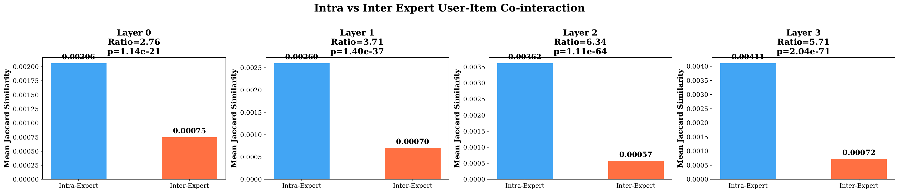 | 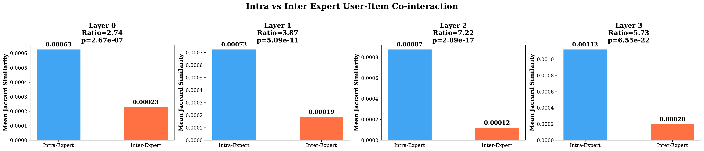 | 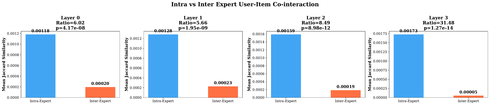 |

---

## Experiment 2: Routing vs User Activity

KL divergence between Low-activity and High-activity users' routing distributions:

| Dataset  | Layer 0 | Layer 1 | Layer 2 | Layer 3 |
|----------|---------|---------|---------|---------|
| Gowalla  | 0.376   | 0.397   | 0.540   | 0.755   |
| Amazon   | 0.264   | 0.249   | 0.378   | 0.510   |
| Yelp     | 0.367   | 0.595   | 0.840   | 0.836   |

| Gowalla | Amazon | Yelp |
|---------|--------|------|
| 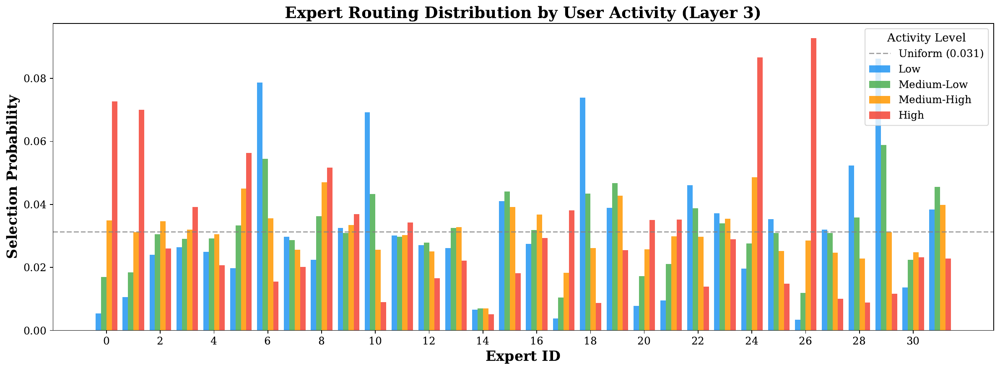 | 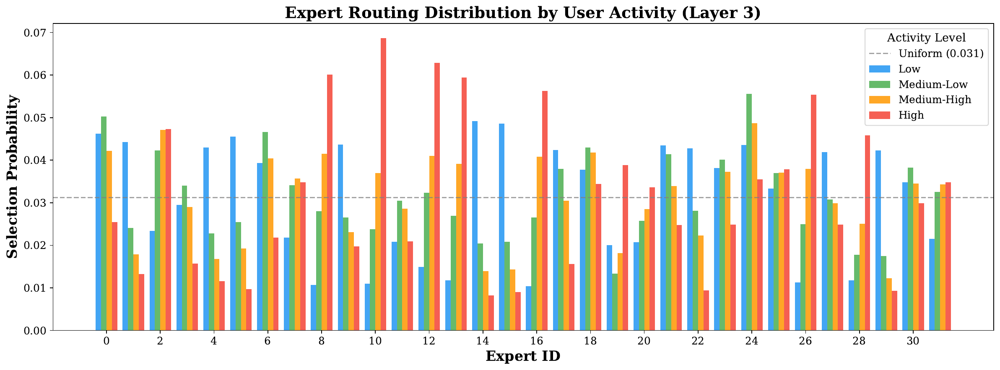 | 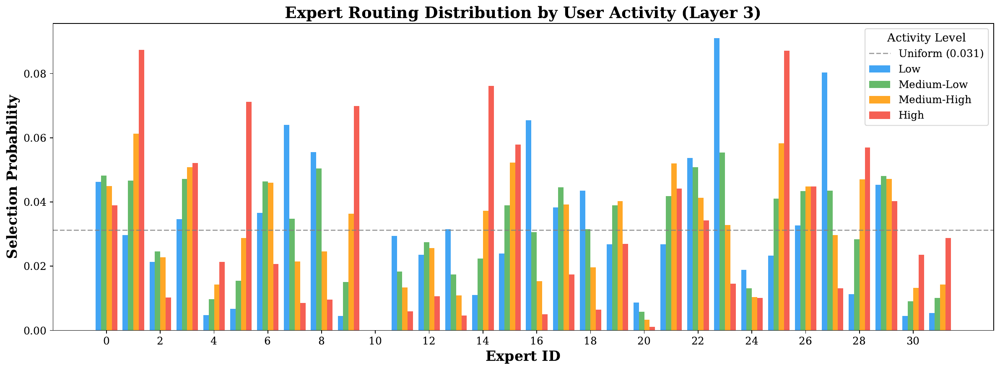 |

---

## Experiment 3: Expert Item Specialization

JSD of expert item distributions vs random baseline (ratio > 1 = specialization beyond chance):

| Dataset  | JSD Ratio (L0) | JSD Ratio (L1) | JSD Ratio (L2) | JSD Ratio (L3) | Top-50 Overlap (L3) |
|----------|----------------|----------------|----------------|----------------|---------------------|
| Gowalla  | 1.30×          | 1.37×          | 1.40×          | 1.45×          | 5.5%                |
| Amazon   | 1.29×          | 1.36×          | 1.44×          | 1.50×          | 5.6%                |
| Yelp     | 1.16×          | 1.17×          | 1.16×          | 1.16×          | 3.0%                |

| Gowalla | Amazon | Yelp |
|---------|--------|------|
| 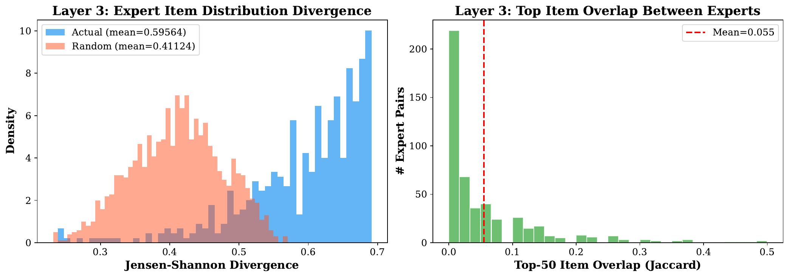 | 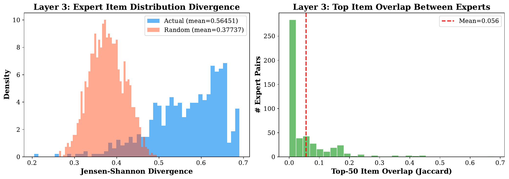 | 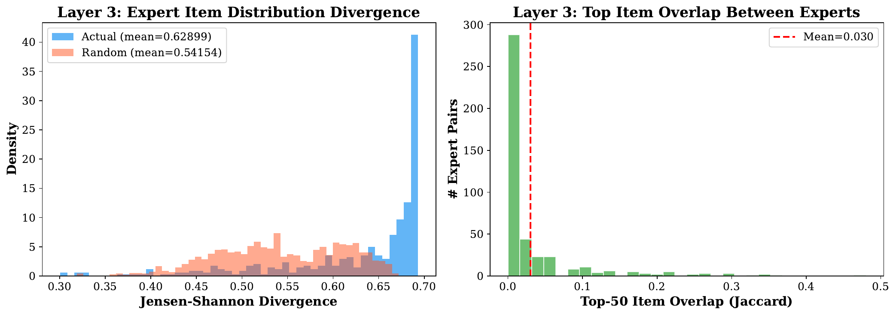 |

---

## Experiment 4: RoPE Inter-Layer Distinguishability

Average pairwise cosine similarity between layer embeddings (lower = less over-smoothing):

| Dataset  | With RoPE | Without RoPE | Reduction |
|----------|-----------|--------------|-----------|
| Gowalla  | 0.765     | 0.889        | 14.0%     |
| Amazon   | 0.798     | 0.911        | 12.4%     |
| Yelp     | 0.938     | 0.967        | 3.0%      |

| Gowalla | Amazon | Yelp |
|---------|--------|------|
|  | 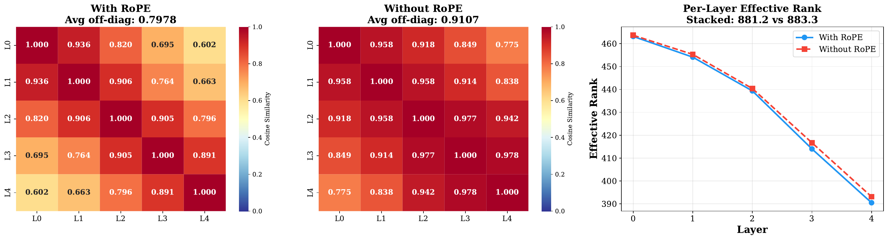 | 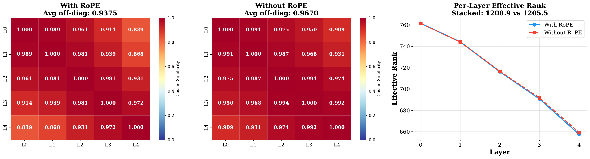 |

---

## Experiment 5: Cross-Dataset Sparsity Analysis

| Dataset  | Sparse users (≤3) | Active users (≥10) | Active/Sparse intent clustering |
|----------|-------------------|--------------------|--------------------------------|
| Gowalla  | 24.3%             | 34.7%              | 3.44×                          |
| Amazon   | 9.8%              | 40.6%              | 2.43×                          |
| Yelp     | 61.6%             | 7.1%               | 1.84×                          |

---

## Experiment 6: Depth Ablation — Vanilla GCN vs Hi-MoE

Gowalla Recall@20 under increasing propagation depth:

| Layers | Vanilla GCN | Hi-MoE (w/ RoPE) |
|--------|-------------|-------------------|
| 2      | TBD         | 0.2711            |
| 3      | TBD         | 0.2693            |
| 4      | TBD         | 0.2712            |
| 5      | TBD         | 0.2680            |
| 6      | TBD         | —                 |
| 8      | TBD         | —                 |

---

## Experiment 7: Shared Expert Contribution

| Config | Gowalla R@20 |
|--------|-------------|
| Full Hi-MoE | 0.2712 |
| w/o shared expert | TBD |
| w/o routed experts | 0.2675 |

All PDF figures are available in the `results/` directory.
